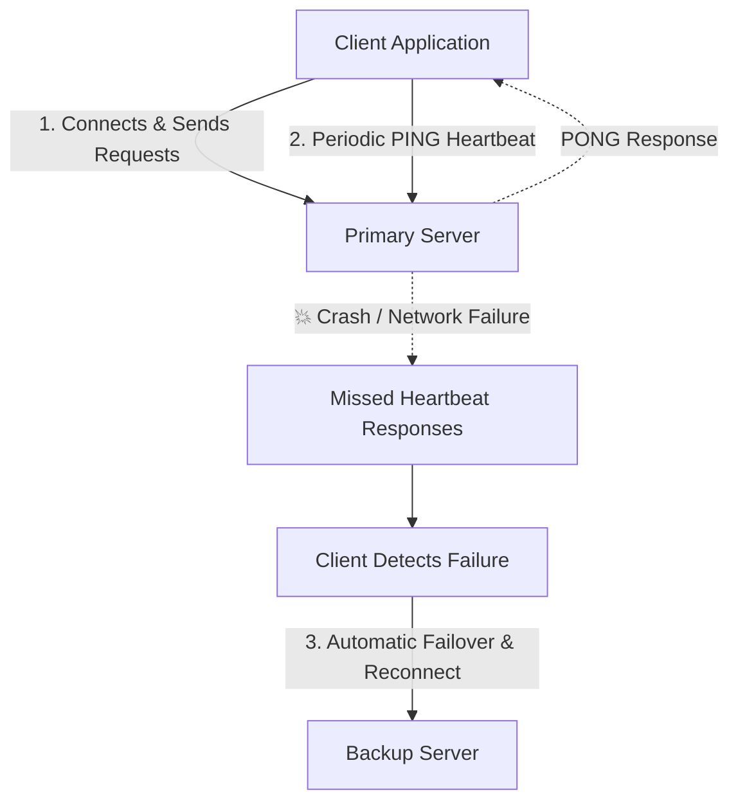

# NetFailover 🔄

A simple Python-based Computer Networks project demonstrating **network fault detection** and **automatic server failover**.

---

## 📌 Project Overview

In computer networking and distributed systems, **high availability** is critical. If a primary server crashes or becomes unreachable, the network should automatically detect the failure and redirect client requests to a backup (standby) server without significant downtime.

**NetFailover** simulates this core networking concept using standard Python sockets and heartbeat monitoring.

---

## ⚙️ How It Works

1. **Primary Server**: Listens for client connections, handles requests, and responds to heartbeat probes (`PING` -> `PONG`).
2. **Backup Server**: Runs as a standby server ready to accept incoming client connections if the primary server fails (the backup server does not monitor the primary heartbeat in this implementation).
3. **Client Heartbeat (PING / PONG)**: The client maintains an active connection with the Primary Server and sends periodic `PING` messages, expecting `PONG` responses to verify server liveness.
4. **Fault Detection**: If the primary server crashes or becomes unreachable, the client detects consecutive missed `PONG` responses or connection timeouts.
5. **Automatic Failover**: Upon detecting primary failure, the client automatically initiates a failover and reconnects to the Backup Server to resume communication.



---

## 📁 Planned Project Structure

```text
NetFailover/
├── README.md               # Project documentation
├── .gitignore              # Ignored files (virtualenv, caches, etc.)
├── primary_server.py       # Primary server implementation
├── backup_server.py        # Backup/standby server with heartbeat monitor
└── client.py               # Test client sending requests
```

---

## 🧠 Key Networking Concepts Learned

- **Socket Programming (`socket` module)**: TCP/UDP communication between client and server.
- **Heartbeat & Keepalive Protocol**: Using periodic signals to detect node liveness.
- **Timeouts & Fault Detection**: Identifying lost connectivity or server crashes without explicit shutdown signals.
- **Failover & Redundancy**: Transitioning from a standby state to an active state to maintain system availability.

---

## 🚀 Getting Started

### Prerequisites
- Python 3.8+ (no third-party dependencies required; uses standard libraries)

*(Implementation files and execution steps will be added in upcoming steps)*
